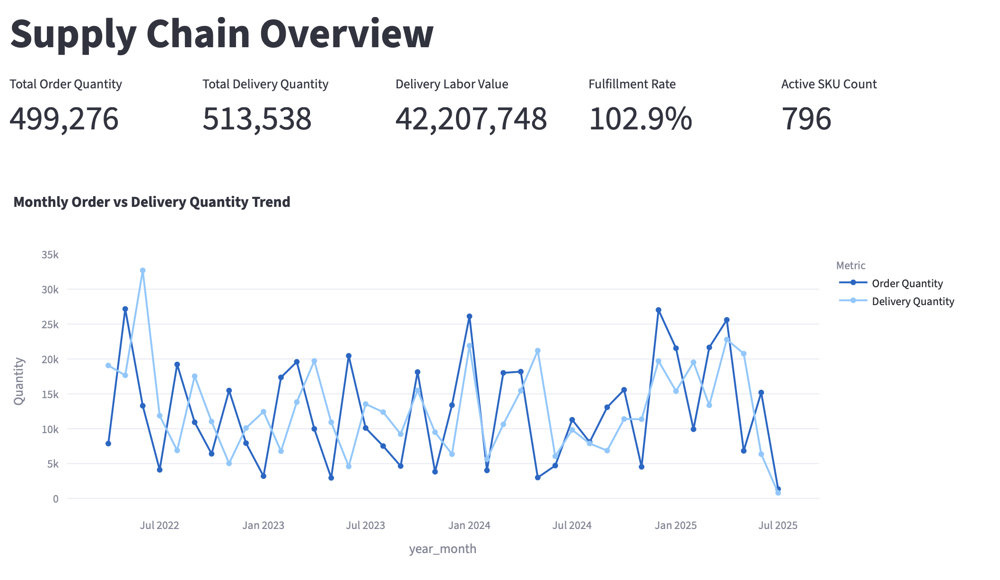
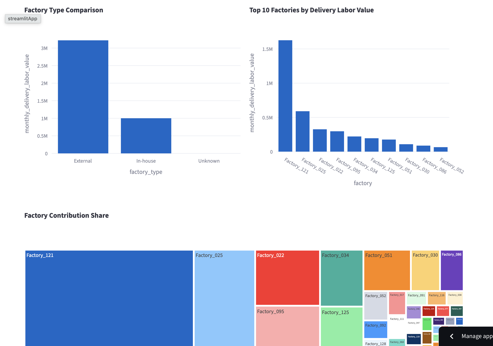
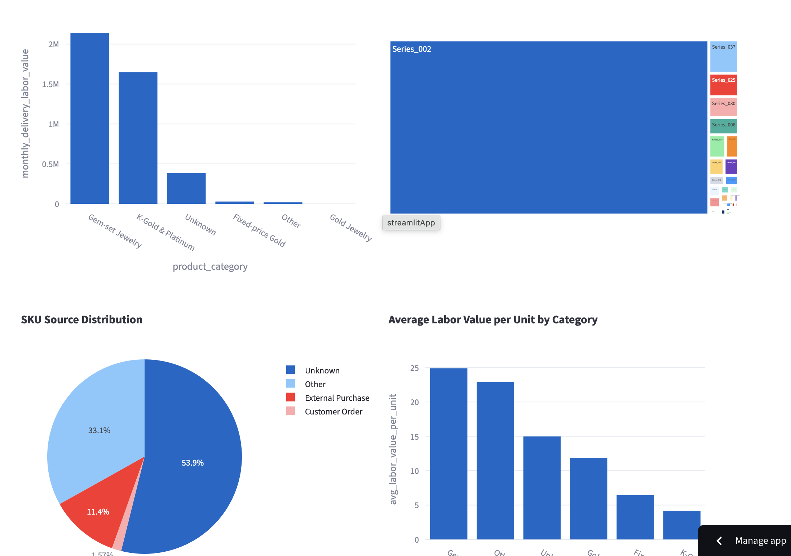
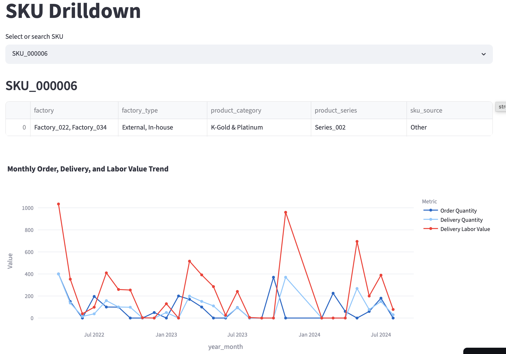
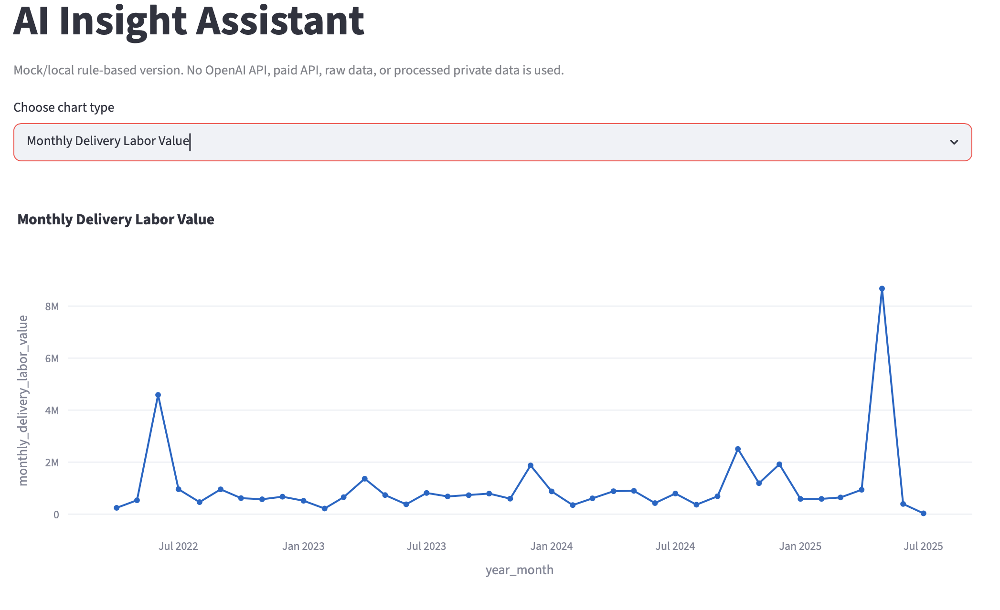

# Jewelry Supply Chain Analytics with AI Insight Assistant

Independent student portfolio project inspired by internship experience in jewelry supply chain analytics. The public repository and live demo use anonymized and generalized sample data only; this is not a company production system.

## Live Demo

- Live Streamlit Dashboard: [jewelry-supply-chain-analytics-btxw2gk2pqkzzqy7eqkapp.streamlit.app](https://jewelry-supply-chain-analytics-btxw2gk2pqkzzqy7eqkapp.streamlit.app)
- GitHub repository: privacy-safe portfolio project for data cleaning, KPI analysis, Streamlit dashboarding, and local rule-based insight generation.
- Demo data: `data/sample/anonymized_supply_chain_sample.csv`.
- UI languages: English, Simplified Chinese, and Traditional Chinese.
- Raw company data is never uploaded to GitHub or Streamlit Cloud.
- AI Insight Assistant is a local rule-based analytics module and does not call paid APIs.

## Project Status

- Data cleaning and anonymization pipeline completed.
- Anonymized/generalized sample data generated for public demo use.
- Streamlit dashboard deployed on Streamlit Cloud.
- Tableau Public dashboard planned as the next portfolio milestone.

## Project Overview

This project analyzes monthly jewelry supply chain performance across anonymized SKU, factory, factory type, product category, product series, SKU source, order quantity, delivery quantity, and delivery labor value.

The goal is to demonstrate an end-to-end analytics workflow:

- ingest private Excel files locally,
- clean and standardize operational fields,
- create a privacy-safe public sample dataset,
- calculate supply chain KPIs,
- build an interactive Streamlit dashboard,
- generate local rule-based business insights.

## Business Context

Jewelry manufacturing and retail supply chains often involve high SKU complexity, mixed in-house and external capacity, seasonal product series, and fulfillment pressure across factories. A practical analytics workflow should help answer:

- Which product categories and series contribute the most delivery value?
- How do monthly order and delivery quantities compare?
- Which factories contribute the largest share of delivery labor value?
- How concentrated is supplier dependency?
- How does in-house production compare with external sourcing?
- Which trends or anomalies deserve follow-up analysis?

## KPI Framework

Core KPI definitions are documented in [docs/kpi_definitions.md](docs/kpi_definitions.md). The dashboard currently focuses on:

- Total Order Quantity
- Total Delivery Quantity
- Delivery Labor Value
- Fulfillment Rate
- Delivery Gap
- Active SKU Count
- Factory Contribution Share
- In-house vs External Share
- Product Category and Product Series Contribution
- Average Labor Value per Unit
- Supplier Top 5 Share
- Supplier HHI

These KPIs are calculated from anonymized sample data in the public dashboard and from local private data only during private development.

## Dashboard Pages

The Streamlit app reads only `data/sample/anonymized_supply_chain_sample.csv`.

- Supply Chain Overview: KPI cards, monthly order vs delivery trend, delivery labor value trend, fulfillment rate trend.
- Supplier Performance: factory type comparison, top factories, contribution share, supplier top 5 share, HHI, sortable supplier table.
- Product Mix: product category contribution, product series contribution, SKU source distribution, average labor value per unit by category.
- SKU Drilldown: searchable SKU selection, monthly order/delivery/labor value trend, related factory and product attributes.
- AI Insight Assistant: local page-level insights for overview, suppliers, product mix, and SKU drill-down.

The dashboard includes a lightweight UI language switcher for English, Simplified Chinese, and Traditional Chinese. This translates interface labels, page titles, chart titles, controls, and rule-based insight headings/templates only. It does not modify anonymized sample data values such as `Factory_001`, `SKU_000001`, `Series_001`, `Internal Design`, `External Purchase`, `In-house`, or public product category labels.

## Dashboard Preview

The deployed Streamlit dashboard uses anonymized sample data only. No raw company data is included.

### Executive Overview



### Supplier Performance



### Product Mix



### SKU Drill-down



### AI Insight Assistant



The AI Insight Assistant is implemented as a local rule-based analytics module and does not call any paid API.

## AI Insight Assistant

The AI Insight Assistant is designed as a zero-budget portfolio feature. It does not call OpenAI, local LLMs, paid APIs, raw data, or processed private data.

Current behavior:

- generates page-level insights for Executive Overview, Supplier Performance, Product Mix, and SKU Drill-down,
- supports concise, detailed, and action-oriented output styles,
- runs local rules for fulfillment, delivery gap, supplier concentration, category mix, source mix, and SKU volatility,
- returns structured sections: executive summary, key metrics, trend interpretation, top contributors, potential anomalies, suggested business actions, and data privacy note,
- displays a future optional LLM prompt template without sending data anywhere.

This design is privacy-safe and zero-budget because all insight text is produced from in-memory aggregations of `data/sample/anonymized_supply_chain_sample.csv`. No data leaves the app, no external model is called, and the assistant never receives raw Excel files, processed private parquet files, mapping tables, product image paths, or raw product descriptions. The assistant can render section headings and common insight patterns in English, Simplified Chinese, or Traditional Chinese while preserving anonymized data labels.

Future versions may optionally support OpenAI API or local LLM integration, but only through local environment variables and never with committed API keys.

## Data Privacy Notice

This repository is safe for public GitHub and Streamlit Cloud use only because it contains anonymized/generalized sample data.

- Raw Excel files are not uploaded.
- Full processed private parquet files are not uploaded.
- Factory names are anonymized as `Factory_001`, `Factory_002`, and so on.
- Factory type values are generalized as `In-house`, `External`, `Partner`, `Unknown`, or `Other`.
- SKU identifiers are anonymized as `SKU_000001`, `SKU_000002`, and so on.
- Product categories are generalized into public English categories.
- Product series values are anonymized as `Series_001`, `Series_002`, and so on.
- SKU source values are generalized as `Internal Design`, `External Purchase`, `Customer Order`, `Unknown`, or `Other`.
- `image_path` and `product_description` are excluded from public sample data.
- Labor value metrics may be scaled by a consistent ratio.
- API keys, credentials, `.env`, and `.env.*` files are ignored and must not be committed.

See [docs/privacy_notice.md](docs/privacy_notice.md) for the detailed policy.

## Tech Stack

- Python for data processing and automation
- pandas and NumPy for tabular analytics
- DuckDB and PyArrow for local analytical storage
- openpyxl for local Excel ingestion
- Streamlit for the dashboard
- Plotly for interactive charts
- python-dotenv for local-only configuration
- Jupyter and ipykernel for exploratory notebooks
- pytest for tests
- Ruff for linting

No paid API dependency is required for the current version.

## Project Structure

```text
.
├── AGENTS.md
├── README.md
├── requirements.txt
├── assets/
├── dashboard/
│   ├── components/
│   └── pages/
├── data/
│   ├── dictionaries/
│   ├── processed/
│   ├── raw/
│   └── sample/
├── docs/
│   ├── data_dictionary.md
│   ├── kpi_definitions.md
│   ├── privacy_notice.md
│   └── workflow.md
├── notebooks/
├── src/
├── tableau/
│   └── screenshots/
└── tests/
```

## How to Run Locally

Create a virtual environment:

```bash
python -m venv .venv
source .venv/bin/activate
```

Install dependencies:

```bash
pip install -r requirements.txt
```

For private local development only, place the raw Excel file under `data/raw/`. Do not commit raw Excel files.

Clean the local Excel file into a local-only parquet file:

```bash
python -m src.clean --input data/raw/your_file.xlsx
```

Create the anonymized public sample CSV:

```bash
python -m src.anonymize --max-rows 10000 --scale-factor 1.0
```

Run the Streamlit app:

```bash
streamlit run dashboard/streamlit_app.py
```

Commit only privacy-safe code, docs, assets, and reviewed sample data. Do not commit `data/raw/`, `data/processed/`, Excel files, `.env`, API keys, credentials, raw product descriptions, or mapping tables.

## Future Work

- Build a Tableau Public dashboard using the same anonymized sample data.
- Add richer anomaly detection and KPI explanations.
- Add unit tests for anonymization rules.
- Add optional local LLM or OpenAI integration through uncommitted environment variables.
- Expand portfolio case-study documentation with privacy-safe screenshots and executive findings.
